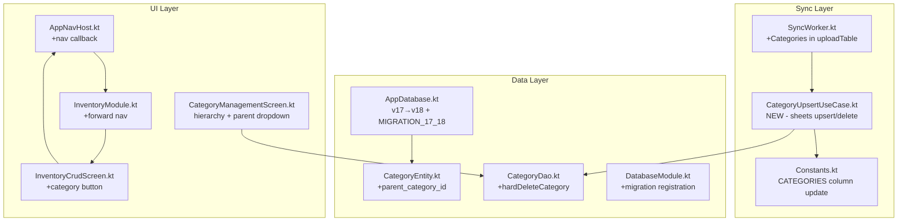
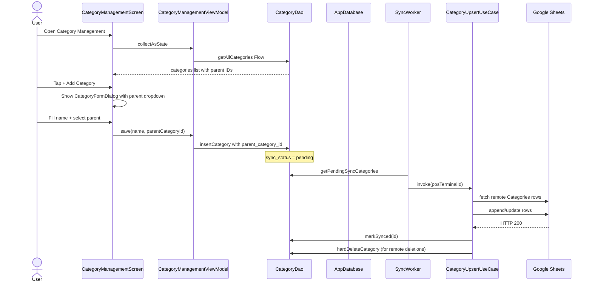

# Hierarchical Category Management (Main & Sub-Categories) with Google Sheets Sync

## Architecture Overview

## Data Flow

## Step-by-Step Implementation Plan

### Step 1: [`CategoryEntity.kt`](file:///c:/Users/Faii/Desktop/Tillzo/app/src/main/java/com/tillzo/pos/data/local/entity/CategoryEntity.kt)
**Action:** Add `parent_category_id` field and update `toSyncMap()`
- Add `val parent_category_id: String? = null` with default `null`
- In `toSyncMap()`, add `"parent_category_id" to (parent_category_id ?: "")` entry after `"category_name"`

### Step 2: [`AppDatabase.kt`](file:///c:/Users/Faii/Desktop/Tillzo/app/src/main/java/com/tillzo/pos/data/local/AppDatabase.kt)
**Action:** Create MIGRATION_17_18 and increment DB version
- Change `version = 17` to `version = 18`
- Add `MIGRATION_17_18` object that runs `ALTER TABLE \`Categories\` ADD COLUMN \`parent_category_id\` TEXT DEFAULT NULL`

### Step 3: [`DatabaseModule.kt`](file:///c:/Users/Faii/Desktop/Tillzo/app/src/main/java/com/tillzo/pos/di/DatabaseModule.kt)
**Action:** Register the new migration
- Add `AppDatabase.MIGRATION_17_18` to the `.addMigrations(...)` chain in `provideAppDatabase()`

### Step 4: [`Constants.kt`](file:///c:/Users/Faii/Desktop/Tillzo/app/src/main/java/com/tillzo/pos/utils/Constants.kt)
**Action:** Update Sheet column mapping
- In `SheetColumns.CATEGORIES`, insert `"parent_category_id"` immediately after `"category_name"`

### Step 5: [`CategoryDao.kt`](file:///c:/Users/Faii/Desktop/Tillzo/app/src/main/java/com/tillzo/pos/data/local/dao/CategoryDao.kt)
**Action:** Add hard-delete query for sync reconciliation
- Add `@Query("DELETE FROM Categories WHERE system_row_id = :id") suspend fun hardDeleteCategory(id: String)`

### Step 6: [NEW] [`CategoryUpsertUseCase.kt`](file:///c:/Users/Faii/Desktop/Tillzo/app/src/main/java/com/tillzo/pos/domain/sync/usecase/CategoryUpsertUseCase.kt)
**Action:** Create new UseCase patterned after [`InventoryUpsertUseCase.kt`](file:///c:/Users/Faii/Desktop/Tillzo/app/src/main/java/com/tillzo/pos/domain/sync/usecase/InventoryUpsertUseCase.kt)
- Inject `CategoryDao`, `SheetsRepository`, `SheetsRemoteDataSource`
- Fetch remote "Categories" rows, build `system_row_id` → row index map
- Upsert pending items (append new / update matched rows)
- Process deletions: for `is_deleted = 1` remote rows, call `hardDeleteCategory(id)`
- Return `Boolean` success/failure

### Step 7: [`SyncWorker.kt`](file:///c:/Users/Faii/Desktop/Tillzo/app/src/main/java/com/tillzo/pos/data/sync/options/worker/SyncWorker.kt)
**Action:** Wire Categories into the sync pipeline
- Inject `categoryUpsertUseCase: CategoryUpsertUseCase` into constructor
- In `doWork()`, add `syncLogDao.ensureTableRegistered("Categories")` 
- In `uploadTable(tableName)`, add case `"Categories" -> categoryUpsertUseCase(posTerminalId)`

### Step 8: [`AppNavHost.kt`](file:///c:/Users/Faii/Desktop/Tillzo/app/src/main/java/com/tillzo/pos/ui/AppNavHost.kt)
**Action:** Pass navigation callback to InventoryModule
- Update the `inventory_module` composable to pass `onNavigateToCategories = { navController.navigate("category_management") }` to `InventoryModule()`

### Step 9: [`InventoryModule.kt`](file:///c:/Users/Faii/Desktop/Tillzo/app/src/main/java/com/tillzo/pos/ui/inventory/InventoryModule.kt)
**Action:** Forward navigation callback
- Add `onNavigateToCategories: () -> Unit = {}` parameter
- Pass it to `InventoryCrudScreen()` composable

### Step 10: [`InventoryCrudScreen.kt`](file:///c:/Users/Faii/Desktop/Tillzo/app/src/main/java/com/tillzo/pos/ui/inventory/options/crud/InventoryCrudScreen.kt)
**Action:** Add category management trigger
- Add `onNavigateToCategories: () -> Unit` parameter to function signature
- In the TopAppBar `actions`, add a category icon button (`Icons.Default.Category`) that calls `onNavigateToCategories`
- In the `InventoryFormDialog` category dropdown, modify the "Manage Categories..." item callback to dismiss the dialog and trigger `onNavigateToCategories()`

### Step 11: [`CategoryManagementScreen.kt`](file:///c:/Users/Faii/Desktop/Tillzo/app/src/main/java/com/tillzo/pos/ui/inventory/CategoryManagementScreen.kt)
**Action:** Implement hierarchical display and parent selection
- **ViewModel changes:**
  - Update `save(existing, name, posTerminalId)` → `save(existing, name, parentCategoryId, posTerminalId)`
  - Insert `parent_category_id` when creating new `CategoryEntity`
- **Screen changes:**
  - Sort/group categories: display Main Categories (where `parent_category_id` is null/empty), indent child subcategories beneath with `Icons.Default.SubdirectoryArrowRight` icon
  - Modify `CategoryFormDialog`:
    - Add a dropdown for "Parent Category" selection
    - Restrict options to only **Main Categories** (`parent_category_id` is null) to prevent multi-level nesting
    - Include default choice "None (Main Category)"
    - When editing, exclude the current category from the parent dropdown (circular prevention)
  - Update delete callback: when deleting a Main Category, cascade soft-delete all child subcategories

## Key Design Decisions

1. **Single level of nesting only** - Parent dropdown restricts to Main Categories only (no grandchild categories)
2. **Cascade soft-delete** - Deleting a Main Category automatically soft-deletes all children with `sync_status = "pending"`
3. **Google Sheets wins on conflict** - Overwrite local with sheet values if both are updated
4. **Offline-first creation** - Save locally with `sync_status = "pending"`, sync when online
5. **Hard delete after sync** - Categories deleted remotely are removed from local DB via `hardDeleteCategory`

## Files Modified (10)
| # | File | Change Type |
|---|------|-------------|
| 1 | [`CategoryEntity.kt`](file:///c:/Users/Faii/Desktop/Tillzo/app/src/main/java/com/tillzo/pos/data/local/entity/CategoryEntity.kt) | Modify |
| 2 | [`AppDatabase.kt`](file:///c:/Users/Faii/Desktop/Tillzo/app/src/main/java/com/tillzo/pos/data/local/AppDatabase.kt) | Modify |
| 3 | [`DatabaseModule.kt`](file:///c:/Users/Faii/Desktop/Tillzo/app/src/main/java/com/tillzo/pos/di/DatabaseModule.kt) | Modify |
| 4 | [`Constants.kt`](file:///c:/Users/Faii/Desktop/Tillzo/app/src/main/java/com/tillzo/pos/utils/Constants.kt) | Modify |
| 5 | [`CategoryDao.kt`](file:///c:/Users/Faii/Desktop/Tillzo/app/src/main/java/com/tillzo/pos/data/local/dao/CategoryDao.kt) | Modify |
| 6 | [`SyncWorker.kt`](file:///c:/Users/Faii/Desktop/Tillzo/app/src/main/java/com/tillzo/pos/data/sync/options/worker/SyncWorker.kt) | Modify |
| 7 | [`AppNavHost.kt`](file:///c:/Users/Faii/Desktop/Tillzo/app/src/main/java/com/tillzo/pos/ui/AppNavHost.kt) | Modify |
| 8 | [`InventoryModule.kt`](file:///c:/Users/Faii/Desktop/Tillzo/app/src/main/java/com/tillzo/pos/ui/inventory/InventoryModule.kt) | Modify |
| 9 | [`InventoryCrudScreen.kt`](file:///c:/Users/Faii/Desktop/Tillzo/app/src/main/java/com/tillzo/pos/ui/inventory/options/crud/InventoryCrudScreen.kt) | Modify |
| 10 | [`CategoryManagementScreen.kt`](file:///c:/Users/Faii/Desktop/Tillzo/app/src/main/java/com/tillzo/pos/ui/inventory/CategoryManagementScreen.kt) | Modify |

## Files Created (1)
| # | File | Change Type |
|---|------|-------------|
| 1 | [`CategoryUpsertUseCase.kt`](file:///c:/Users/Faii/Desktop/Tillzo/app/src/main/java/com/tillzo/pos/domain/sync/usecase/CategoryUpsertUseCase.kt) | Create |
