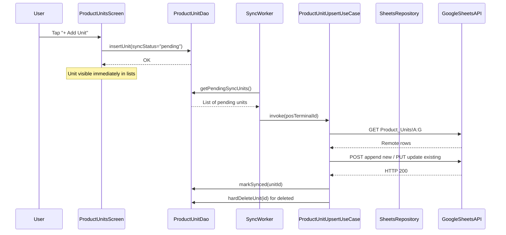

> **STATUS: ✅ IMPLEMENTED (2026-08-25)** — plan ke mutabiq code complete, V1 changelog mein logged.

# Product Units Management with Google Sheets Sync — Implementation Plan

## Overview
Wire existing `ProductUnitEntity` and `ProductUnitsScreen` into the Google Sheets sync pipeline, expose "Units" navigation from the Inventory CRUD screen, and add "Manage Units..." shortcut in the product form's unit dropdown.

## Architecture & Data Flow

## Files to MODIFY (10 files)

### 1. [`ProductUnitEntity.kt`](app/src/main/java/com/tillzo/pos/data/local/entity/ProductUnitEntity.kt)
- **Change:** Add `toSyncMap()` helper function returning `Map<String, Any>`
- **Change:** Update default `syncStatus` from `"synced"` to `"pending"` for user-created units, keep `"synced"` for seed defaults

### 2. [`Constants.kt`](app/src/main/java/com/tillzo/pos/utils/Constants.kt)
- **Change:** Add `val PRODUCT_UNITS = listOf("unitId","unitName","abbreviation","isDeleted","syncStatus","createdAt","updatedAt")` to `SheetColumns` object

### 3. [`ProductUnitDao.kt`](app/src/main/java/com/tillzo/pos/data/local/dao/ProductUnitDao.kt)
- **Change:** Add 4 new queries:
  - `getPendingSyncUnits()` — `syncStatus = 'pending'`
  - `getPendingSyncDeleted()` — `isDeleted = 1 AND syncStatus = 'pending'`
  - `hardDeleteUnit(id: String)` — `DELETE FROM product_units WHERE unitId = :id`
  - `markSynced(id: String)` — `UPDATE product_units SET syncStatus = 'synced' WHERE unitId = :id`

### 4. [`SheetsRepository.kt`](app/src/main/java/com/tillzo/pos/data/repository/SheetsRepository.kt)
- **Line 46:** Add `"Product_Units"` to `sheetDefs` list in `createWorkspace()`
- **Lines 83-92:** Add `"Product_Units"` mapping to `SheetColumns.PRODUCT_UNITS` in `uploadBatch()`
- **Lines 173-196:** Add `"Product_Units"` to `buildHeaders()` with `SheetColumns.PRODUCT_UNITS`

### 5. [`SchemaGuardUseCase.kt`](app/src/main/java/com/tillzo/pos/domain/sync/usecase/SchemaGuardUseCase.kt)
- **Line 21-34:** Add `"Product_Units" to SheetColumns.PRODUCT_UNITS` in `TAB_HEADERS`
- **Line 45-50:** Add `"Product_Units"` to `requiredTabs` list

### 6. [`SyncWorker.kt`](app/src/main/java/com/tillzo/pos/data/sync/options/worker/SyncWorker.kt)
- **Import:** Add `ProductUnitUpsertUseCase`
- **Constructor:** Inject `productUnitUpsertUseCase: ProductUnitUpsertUseCase`
- **Line 73-76:** Add `syncLogDao.ensureTableRegistered("Product_Units")`
- **Line 206-218:** Add `"Product_Units" -> productUnitUpsertUseCase(posTerminalId)` in `uploadTable()` when-expression

### 7. [`AppNavHost.kt`](app/src/main/java/com/tillzo/pos/ui/AppNavHost.kt)
- **Line 121-126:** Pass `onNavigateToUnits = { navController.navigate("product_units") }` to `InventoryModule` (route already exists at line 231)

### 8. [`InventoryModule.kt`](app/src/main/java/com/tillzo/pos/ui/inventory/InventoryModule.kt)
- **Signature:** Add `onNavigateToUnits: () -> Unit = {}` parameter
- **Line 25-31:** Pass `onNavigateToUnits = onNavigateToUnits` to `InventoryCrudScreen`

### 9. [`InventoryCrudScreen.kt`](app/src/main/java/com/tillzo/pos/ui/inventory/options/crud/InventoryCrudScreen.kt)
- **Signature:** Add `onNavigateToUnits: () -> Unit = {}` parameter
- **Lines 86-107 (TopAppBar actions):** Add a "Units" button next to "Categories" button using `Icons.Default.Scale` (or similar)
- **Lines 562-593 (Units dropdown):** Add a "Manage Units..." `DropdownMenuItem` at the top of the units dropdown that calls `onNavigateToUnits()`

### 10. [`ProductUnitsScreen.kt`](app/src/main/java/com/tillzo/pos/ui/inventory/ProductUnitsScreen.kt)
- **Lines 69-80 (addUnit):** Set `syncStatus = "pending"` for custom units
- **Line 113:** Migrate `Icons.Default.ArrowBack` to `Icons.AutoMirrored.Filled.ArrowBack`
- **Add:** `@OptIn(ExperimentalMaterial3Api::class)` where needed

## Files to CREATE (1 file)

### 11. [`ProductUnitUpsertUseCase.kt`](app/src/main/java/com/tillzo/pos/domain/sync/usecase/ProductUnitUpsertUseCase.kt) — **NEW FILE**
- Patterned after [`CategoryUpsertUseCase.kt`](app/src/main/java/com/tillzo/pos/domain/sync/usecase/CategoryUpsertUseCase.kt)
- Inject `ProductUnitDao`, `SheetsRepository`, `SheetsRemoteDataSource`
- Fetch remote `"Product_Units"` rows from spreadsheet
- Build `unitId` to row index mapping (using `unitId` column, not `system_row_id`)
- Upsert pending items: append new rows or write updates to matched rows
- Handle deletions: physically delete rows from Sheet, then `hardDeleteUnit(id)` locally
- Columns order: `unitId, unitName, abbreviation, isDeleted, syncStatus, createdAt, updatedAt`

## Implementation Order

1. Entity layer: `ProductUnitEntity.kt` (toSyncMap + default syncStatus)
2. Constants: `Constants.kt` (PRODUCT_UNITS columns)
3. DAO layer: `ProductUnitDao.kt` (sync queries)
4. Repository: `SheetsRepository.kt` (register sheet defs, headers, column mapping)
5. Schema guard: `SchemaGuardUseCase.kt` (register header verification)
6. **NEW** UseCase: `ProductUnitUpsertUseCase.kt`
7. Sync worker: `SyncWorker.kt` (inject + wire use case)
8. Navigation: `AppNavHost.kt` → `InventoryModule.kt` → `InventoryCrudScreen.kt` (wire Units button + dropdown shortcut)
9. UI cleanup: `ProductUnitsScreen.kt` (syncStatus defaults, icon migration)

## Edge Cases & Sync Protocol

| Scenario | Behavior |
|---|---|
| Offline creation | Save locally with `syncStatus = "pending"`, display in lists immediately |
| Sync conflict | Google Sheets wins — overwrite local with spreadsheet values on next delta sync |
| Deletion | Soft-delete sets `isDeleted=1`, SynWorker picks up via `getPendingSyncDeleted()`, physically removes row from Sheet, then `hardDeleteUnit()` locally |
| First launch seeding | 7 defaults seeded with `syncStatus = "synced"` — never sent to Sheets |
