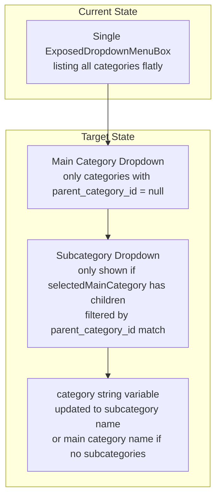
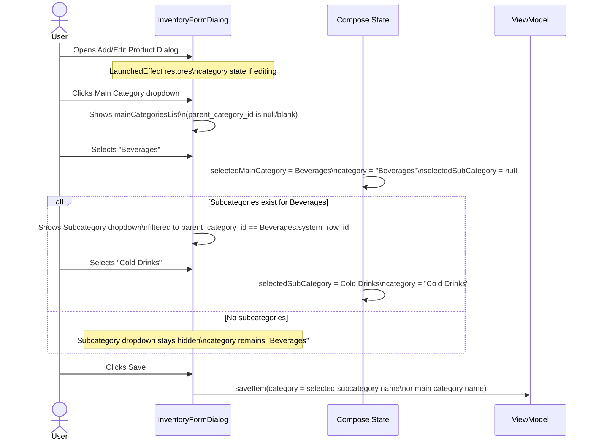

# Two-Step Hierarchical Category Selection in Product Form

## Overview

Replace the single flat category dropdown in `InventoryFormDialog` with a two-step hierarchical selector that first lets users pick a **Main Category**, then conditionally shows a **Subcategory** dropdown based on the selected main category.

## Architecture & Data Flow

## Data Model Context

The [`CategoryEntity`](app/src/main/java/com/tillzo/pos/data/local/entity/CategoryEntity.kt:17) already supports hierarchy via `parent_category_id: String? = null`:
- **Main Category**: `parent_category_id` is `null` or blank
- **Subcategory**: `parent_category_id` is set to the parent's `system_row_id`

The [`InventoryCrudViewModel`](app/src/main/java/com/tillzo/pos/ui/inventory/options/crud/InventoryCrudViewModel.kt:49) already exposes `allCategories: StateFlow<List<CategoryEntity>>` which is consumed in the screen.

## File to Modify

| # | File | Change |
|---|------|--------|
| 1 | [`InventoryCrudScreen.kt`](app/src/main/java/com/tillzo/pos/ui/inventory/options/crud/InventoryCrudScreen.kt) | Replace lines 506-543 (single category dropdown) with two-step hierarchical selector |

## Step-by-Step Implementation

### Step 1: State Variables
Inside `InventoryFormDialog`, after existing state declarations:
- Add `var selectedMainCategory by remember { mutableStateOf<CategoryEntity?> }` initialized to `null`
- Add `var selectedSubCategory by remember { mutableStateOf<CategoryEntity?> }` initialized to `null`

### Step 2: Edit-Mode State Restoration (LaunchedEffect)
Add a `LaunchedEffect(categories, item)` block after the existing `LaunchedEffect(preFilledWeight)` that:
1. Finds the category in `categories` whose `category_name` matches `item.category` → `matchedCategory`
2. If `matchedCategory` has `parent_category_id != null`:
   - Set `selectedSubCategory = matchedCategory`
   - Set `selectedMainCategory` to the category in `categories` whose `system_row_id` matches `matchedCategory.parent_category_id`
3. If `matchedCategory` has `parent_category_id == null` or blank:
   - Set `selectedMainCategory = matchedCategory`
   - Set `selectedSubCategory = null`

### Step 3: Filtered Category Lists
Add computed lists using `remember`:
- `val mainCategoriesList = remember(categories) { categories.filter { it.parent_category_id.isNullOrBlank() } }`
- `val subCategoriesList = remember(categories) { categories.filter { !it.parent_category_id.isNullOrBlank() } }`

### Step 4: Replace Single Category Dropdown
Replace the existing `ExposedDropdownMenuBox` block (lines 507-543) with:

#### Dropdown 1: Main Category
- `ExposedDropdownMenuBox` whose value displays `selectedMainCategory?.category_name ?: "Select Main Category"`
- Populated with `mainCategoriesList`
- First menu item: "Manage Categories..." → opens `showCategoryManager = true`
- On selection:
  - `selectedMainCategory = selected`
  - `selectedSubCategory = null`
  - `category = selected.category_name`

#### Dropdown 2: Subcategory (Conditional)
- Only rendered when `selectedMainCategory != null`
- Compute: `val availableSubCategories = subCategoriesList.filter { it.parent_category_id == selectedMainCategory.system_row_id }`
- Only render the dropdown if `availableSubCategories.isNotEmpty()`
- `ExposedDropdownMenuBox` whose value displays `selectedSubCategory?.category_name ?: "Select Subcategory"`
- On selection:
  - `selectedSubCategory = selected`
  - `category = selected.category_name`

### Step 5: Theme & Styling
- Reuse the existing `textFieldColors` from `OutlinedTextFieldDefaults.colors()`
- Maintain dark theme consistency with existing outlined text field styles
- The subcategory dropdown must appear dynamically immediately below the main category dropdown

## Edge Cases & Behaviors

| Scenario | Required Behavior |
|---|---|
| No subcategories exist for selected main category | Do not display subcategory dropdown; `category` = main category name |
| Editing existing product with subcategory | Pre-select both main and subcategory in their respective dropdowns |
| Editing existing product with main category only | Pre-select main category; subcategory dropdown hidden if no subs exist |
| User switches main category | Reset `selectedSubCategory = null` and recalculate available subcategories |
| Empty categories list | Main category dropdown shows "Select Main Category" with no options (except "Manage Categories...") |

## Verification Checklist

- [ ] Main category dropdown only shows categories with `parent_category_id` = null/blank
- [ ] Subcategory dropdown only shows categories matching the selected parent's `system_row_id`
- [ ] Subcategory dropdown is hidden when selected main category has no subcategories
- [ ] Editing a product with a subcategory correctly pre-selects both dropdowns
- [ ] Editing a product with only a main category correctly pre-selects just the main dropdown
- [ ] Changing the main category resets the subcategory selection
- [ ] `category` saving variable is updated to subcategory name (or main category name if no subs)
- [ ] "Manage Categories..." option still works to open the category manager dialog
