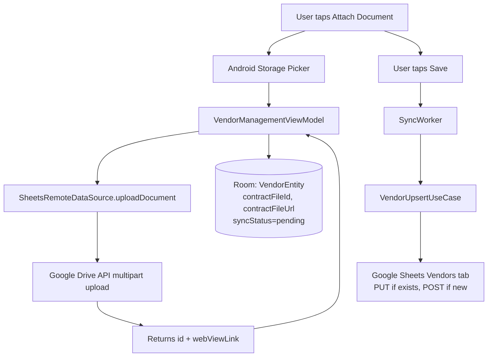
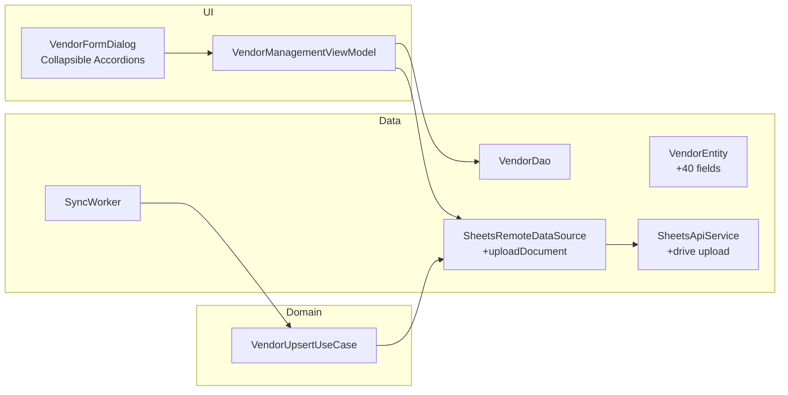

> **STATUS: ✅ IMPLEMENTED (2026-08-25)** — plan ke mutabiq code complete, V1 changelog mein logged.

# Vendor Profiles Extension — Google Drive Document Uploads + Expanded Fields

## Overview

Extend the existing `VendorEntity` with 40+ new fields (financial, geographic, contacts, SLA, document references), add Google Drive multipart upload support, create a `VendorUpsertUseCase` for Sheet reconciliation, and redesign the Vendor form UI with collapsible accordion sections and an attachment picker.

---

## Files to Modify

| File | Action |
|------|--------|
| [`PurchaseOrderEntity.kt`](file:///c:/Users/Faii/Desktop/Tillzo/app/src/main/java/com/tillzo/pos/data/local/entity/PurchaseOrderEntity.kt) | Extend `VendorEntity` with 40+ new fields + update `toSyncMap()` |
| [`AppDatabase.kt`](file:///c:/Users/Faii/Desktop/Tillzo/app/src/main/java/com/tillzo/pos/data/local/AppDatabase.kt) | Add `MIGRATION_18_19` with ALTER TABLE statements + bump version to 19 |
| [`DatabaseModule.kt`](file:///c:/Users/Faii/Desktop/Tillzo/app/src/main/java/com/tillzo/pos/di/DatabaseModule.kt) | Register `MIGRATION_18_19` in `.addMigrations(...)` |
| [`Constants.kt`](file:///c:/Users/Faii/Desktop/Tillzo/app/src/main/java/com/tillzo/pos/utils/Constants.kt) | Update `SheetColumns.VENDORS` list |
| [`SheetsApiService.kt`](file:///c:/Users/Faii/Desktop/Tillzo/app/src/main/java/com/tillzo/pos/data/remote/SheetsApiService.kt) | Add `uploadDriveFile()` multipart endpoint |
| [`SheetsRemoteDataSource.kt`](file:///c:/Users/Faii/Desktop/Tillzo/app/src/main/java/com/tillzo/pos/data/remote/SheetsRemoteDataSource.kt) | Add `uploadDocument()` wrapper function |
| [`VendorDao.kt`](file:///c:/Users/Faii/Desktop/Tillzo/app/src/main/java/com/tillzo/pos/data/local/dao/VendorDao.kt) | Add `getVendorById()` query for upsert lookup |
| [`SyncWorker.kt`](file:///c:/Users/Faii/Desktop/Tillzo/app/src/main/java/com/tillzo/pos/data/sync/options/worker/SyncWorker.kt) | Adapt `uploadPendingVendors()` to use `VendorUpsertUseCase`; update `toSheetRow()` |

## Files to Create

| File | Action |
|------|--------|
| [`VendorUpsertUseCase.kt`](file:///c:/Users/Faii/Desktop/Tillzo/app/src/main/java/com/tillzo/pos/domain/sync/usecase/VendorUpsertUseCase.kt) | New UseCase for vendor upsert reconciling |
| [`VendorManagementViewModel.kt`](file:///c:/Users/Faii/Desktop/Tillzo/app/src/main/java/com/tillzo/pos/ui/inventory/module_b/VendorManagementViewModel.kt) | Refactor to separate file (currently inline in `VendorManagementScreen.kt`) — add `uploadContractFile()` |

---

## Step-by-Step Implementation Tasks

### Task 1: Extend `VendorEntity` schema
**File:** [`PurchaseOrderEntity.kt`](file:///c:/Users/Faii/Desktop/Tillzo/app/src/main/java/com/tillzo/pos/data/local/entity/PurchaseOrderEntity.kt) (lines 92-119)

Add the following fields to `VendorEntity` with defaults:
- **Financial/Tax:** `bankAccountTitle`, `bankName`, `bankAccountNumber`, `bankIban`, `bankSwiftCode`, `bankBranch`, `paymentTerms`, `preferredCurrency`, `creditLimit`, `registrationNumber`, `ntnNumber`, `cnicNumber`, `trnNumber`, `tradeLicenseNumber`, `tradeLicenseExpiryDate`
- **Geographic:** `city`, `province`, `country`, `billingAddress`, `ownerName`
- **Contacts:** `primaryManagerName`, `primaryManagerPhone`, `primaryManagerEmail`, `techSupportName`, `techSupportPhone`, `techSupportEmail`, `billingContactName`, `billingContactPhone`, `billingContactEmail`, `escalationL1Name`, `escalationL1Phone`, `escalationL1Email`, `escalationL2Name`, `escalationL2Phone`, `escalationL2Email`, `escalationL3Name`, `escalationL3Phone`, `escalationL3Email`
- **SLA & Files:** `contractStartDate`, `contractExpiryDate`, `slaResponseTimes`, `warrantyTerms`, `complianceCertificates`, `contractFileId`, `contractFileUrl`

Update `toSyncMap()` to serialize all new fields.

### Task 2: Create Room Migration v18→v19
**File:** [`AppDatabase.kt`](file:///c:/Users/Faii/Desktop/Tillzo/app/src/main/java/com/tillzo/pos/data/local/AppDatabase.kt)

- Change `version = 18` to `version = 19`
- Add `MIGRATION_18_19` with ALTER TABLE statements for each new column (42 ALTER statements wrapped in try/catch)

### Task 3: Register migration in DatabaseModule
**File:** [`DatabaseModule.kt`](file:///c:/Users/Faii/Desktop/Tillzo/app/src/main/java/com/tillzo/pos/di/DatabaseModule.kt)

- Add `AppDatabase.MIGRATION_18_19` to the `.addMigrations(...)` array

### Task 4: Update SheetColumns.VENDORS
**File:** [`Constants.kt`](file:///c:/Users/Faii/Desktop/Tillzo/app/src/main/java/com/tillzo/pos/utils/Constants.kt) (line 185)

Replace:
```kotlin
val VENDORS = listOf("vendor_id", "name", "phone", "whatsapp", "email", "address", "is_deleted", "sync_status", "created_at", "updated_at")
```
With the full list including all new fields.

### Task 5: Add Drive upload endpoint to SheetsApiService
**File:** [`SheetsApiService.kt`](file:///c:/Users/Faii/Desktop/Tillzo/app/src/main/java/com/tillzo/pos/data/remote/SheetsApiService.kt)

Add multipart endpoint:
```kotlin
@Multipart
@POST("https://www.googleapis.com/upload/drive/v3/files")
suspend fun uploadDriveFile(
    @Query("uploadType") uploadType: String = "multipart",
    @Query("fields") fields: String = "id,name,mimeType,webViewLink",
    @Part metadata: MultipartBody.Part,
    @Part file: MultipartBody.Part
): Response<Map<String, Any>>
```

### Task 6: Add uploadDocument wrapper to SheetsRemoteDataSource
**File:** [`SheetsRemoteDataSource.kt`](file:///c:/Users/Faii/Desktop/Tillzo/app/src/main/java/com/tillzo/pos/data/remote/SheetsRemoteDataSource.kt)

Implement `uploadDocument(filename, mimeType, fileBytes)` that:
1. Creates metadata JSON part
2. Creates file binary part
3. Calls `api.uploadDriveFile(...)`
4. Returns `Pair<String, String>` (fileId, webViewLink)

### Task 7: Add getVendorById to VendorDao
**File:** [`VendorDao.kt`](file:///c:/Users/Faii/Desktop/Tillzo/app/src/main/java/com/tillzo/pos/data/local/dao/VendorDao.kt)

Add query:
```kotlin
@Query("SELECT * FROM vendors WHERE vendorId = :vendorId")
suspend fun getVendorById(vendorId: String): VendorEntity?
```

### Task 8: Create VendorUpsertUseCase
**File:** [`domain/sync/usecase/VendorUpsertUseCase.kt`](file:///c:/Users/Faii/Desktop/Tillzo/app/src/main/java/com/tillzo/pos/domain/sync/usecase/VendorUpsertUseCase.kt) (NEW)

Create new UseCase that:
1. Fetches existing UUIDs from the Vendors sheet tab
2. For vendors with existing IDs → PUT/overwrite the row
3. For new vendors → POST/append the row
4. Follows the same pattern as `CategoryUpsertUseCase` / `InventoryUpsertUseCase`

### Task 9: Update SyncWorker.kt
**File:** [`SyncWorker.kt`](file:///c:/Users/Faii/Desktop/Tillzo/app/src/main/java/com/tillzo/pos/data/sync/options/worker/SyncWorker.kt)

1. Inject `VendorUpsertUseCase` into constructor
2. Update `uploadPendingVendors()` to use the UseCase
3. Register "Vendors" in `ensureTableRegistered()`
4. Update `toSheetRow()` extension function to include all new fields

### Task 10: Refactor ViewModel to separate file & implement upload
**File:** [`VendorManagementViewModel.kt`](file:///c:/Users/Faii/Desktop/Tillzo/app/src/main/java/com/tillzo/pos/ui/inventory/module_b/VendorManagementViewModel.kt) (NEW separate file)

1. Extract VM from [`VendorManagementScreen.kt`](file:///c:/Users/Faii/Desktop/Tillzo/app/src/main/java/com/tillzo/pos/ui/inventory/module_b/VendorManagementScreen.kt) into its own file
2. Update `save()` signature to accept all 40+ fields
3. Implement `uploadContractFile(uri: Uri, context: Context)`:
   - Read bytes from URI via ContentResolver
   - Call `SheetsRemoteDataSource.uploadDocument()`
   - Save returned `contractFileId` / `contractFileUrl` to local DB
   - Set `syncStatus = "pending"`

### Task 11: Redesign VendorFormDialog with collapsible sections
**File:** [`VendorManagementScreen.kt`](file:///c:/Users/Faii/Desktop/Tillzo/app/src/main/java/com/tillzo/pos/ui/inventory/module_b/VendorManagementScreen.kt)

1. Convert `AlertDialog` to a full-screen `Dialog` with scrollable content
2. Group fields into collapsible accordion cards:
   - **Basic Info** (existing: name, phone, whatsapp, email, address)
   - **Financial Details** (bank fields, payment terms, currency, credit limit)
   - **Tax & Registration** (NTN, CNIC, TRN, trade license, registration numbers)
   - **Geographic** (city, province, country, billing address, owner name)
   - **Primary Contact** (manager name/phone/email)
   - **Tech Support** (tech support name/phone/email)
   - **Billing Contact** (billing contact name/phone/email)
   - **Escalation L1/L2/L3** (3 levels of escalation contacts)
   - **SLA & Warranty** (contract dates, SLA terms, warranty, compliance)
   - **Documents** (file attachment picker + view link)
3. Add attachment launcher using `rememberLauncherForActivityResult(ActivityResultContracts.GetContent())`
4. Show loading spinner during upload
5. Display filename + "View Attachment" button when file attached

### Task 12: Build & verify
1. Run `./gradlew assembleDebug`
2. Check for compilation errors
3. Fix any issues
4. Repeat until clean build

---

## Data Flow Diagram



## Architecture Layers



---

## Key Design Decisions

1. **Collapsible accordion sections** instead of a flat long form — prevents infinite scrolling while keeping all fields accessible
2. **Separate ViewModel file** — current VM is inline in the Screen file; extracting it follows clean architecture and keeps the Screen focused on composition
3. **VendorUpsertUseCase** follows the established pattern of `CategoryUpsertUseCase` and `InventoryUpsertUseCase` for Sheet reconciliation
4. **try/catch in migration** — follows existing pattern from `MIGRATION_12_13` to handle cases where columns may already exist
5. **Multipart upload via Retrofit** — uses `@Multipart` + `@Part` annotations for Google Drive API v3 compatibility
6. **Dark theme compliance** — retains `Color(0xFF1A1A1A)` scaffold, `Color(0xFF2A2A2A)` cards, and Casio calculator color tokens

## Build Verification

Run after implementation:
```bash
cd c:/Users/Faii/Desktop/Tillzo
./gradlew assembleDebug
```

Check for:
- Compilation errors in Kotlin files
- Hilt/Dagger injection errors
- Room schema validation errors
- KSP annotation processing errors
